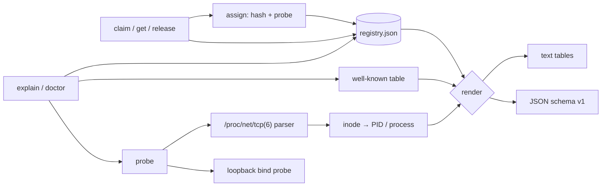

# portberth

[English](README.md) | [中文](README.zh.md) | [日本語](README.ja.md)

[](LICENSE) [](go.mod) [](CHANGELOG.md)  [](CONTRIBUTING.md)

**portberth：オープンソースのローカルポートレジストリ — すべてのプロジェクトに安定した開発ポートを割り当て、すべての競合を出所つきで説明する。killport は殺す、portberth は防ぐ。**


```bash
git clone https://github.com/JaydenCJ/portberth && cd portberth
go build -o portberth ./cmd/portberth    # single static binary, stdlib only
```

> プレリリース：v0.1.0 はまだパッケージレジストリに公開されていません。上記の手順でソースからビルドしてください（Go ≥1.22 なら何でも可）。

## なぜ portberth？

"Port 3000 already in use" は毎日すべての開発者に挨拶してきますが、定番の対処はどれも対症療法です。`killport 3000` は占有者を殺してポートを空けます — 自分で起動したのを忘れていたデータベースまで含めて。`lsof -i :3000` は PID を教えるだけで、考古学はあなたの仕事のまま。`get-port` 系のライブラリは実行のたびに dev server へ*違う*ポートを渡すので、ブックマークも OAuth コールバック URL も同僚の `.env` も腐っていきます。本当の問題は上流にあります：そもそも誰もポートを割り当てていないのです。portberth はその割り当ての工程です。`portberth claim shop/web` は名前を開発レンジ内のポートへ決定的に写像し（ハッシュ + 前方プローブ）、人間が読めるレジストリに記録します — だから `shop/web` は今日も明日も、別のマシンでも同じポート。調整コストはゼロです。そしてポートが*実際に*取り合いになったとき、portberth は証拠を添えて拒否します：どの予約がいつから保持しているか、それが著名ポート（postgres、vite、redis など）かどうか、そして今まさにどのプロセスが占拠しているか — PID とプロセス名つきで。

| | portberth | killport | lsof / fuser | get-port 系ライブラリ |
|---|---|---|---|---|
| 競合を事前に防ぐ（予約機構） | ✅ | ❌ 事後対応 | ❌ 事後対応 | ❌ |
| 同じプロジェクトは毎回・どのマシンでも同じポート | ✅ 決定的 | ❌ | ❌ | ❌ ランダムな空きポート |
| *誰が* *なぜ*ポートを握っているかを説明 | ✅ レジストリ + PID + 著名ポート表 | ❌ | PID のみ | ❌ |
| レジストリ監査（`doctor`） | ✅ | ❌ | ❌ | ❌ |
| プロセスを殺す | ❌ 意図的に非搭載 | ✅ | 手動 | ❌ |
| CLI としてどんなスタックでも使える | ✅ | ✅ | ✅ | ❌ 言語ごとのライブラリ |
| ランタイム依存 | 0（Go 標準ライブラリ） | Rust バイナリ | プリインストール | npm/PyPI の依存ツリー |

<sub>依存数は 2026-07-13 に確認：portberth は Go 標準ライブラリのみを import します。killport は「殺す」ユースケースには良いツールです — portberth はそれが滅多に要らなくなるべきだと主張しているだけです。</sub>

## 特長

- **安定した決定的割り当て** — `claim` は `project/service` をレンジ（デフォルト `3000-3999`）へハッシュし、衝突は前方プローブで回避。同じ名前はどのマシンでも同じポートに写像され、他プロジェクトの予約があなたのポートを動かすことはありません。
- **拒否ではなく、出所つきの説明** — 使えないポートには理由がつきます：保持している予約とその登録日・メモ、著名ポートとしての正体（postgres、vite、redis、kafka など厳選 40 ポート）、そして占拠中の生きたプロセス（`/proc` 経由の PID + 名前）。
- **任意のポートを `explain`** — 1 コマンドでレジストリ・著名ポート・稼働リスナーの 3 信号と結論（`free`、`reserved, not in use`、`in use, not reserved`、`reserved and in use`）を報告し、スクリプト向けの終了コードも対応します。
- **`doctor` が現実と突き合わせて監査** — 手編集による破損（ポート重複・不正エントリ）はエラー、著名ポート上の予約や生きたプロセスによる占拠は警告。`--strict` で警告も失敗に昇格します。
- **スクリプトのための設計** — `get` は `$(...)` 用に裸のポート番号だけを出力、`env --export` は `SHOP_WEB_PORT=3708` 形式の行を出力、どこでも JSON 出力（`schema_version: 1`）が使え、claim は冪等なので起動スクリプトから無条件に claim できます。
- **読めるレジストリ** — ソート済み・アトミック書き込みの JSON ファイル 1 つ（`--registry` / `PORTBERTH_REGISTRY` で変更可）。dotfiles にコミットすればチームでピン留めを共有できます。形式は [docs/registry-format.md](docs/registry-format.md)。
- **依存ゼロ・完全オフライン** — Go 標準ライブラリのみ。唯一のソケット操作は任意のループバック bind プローブで、パケットは一切送信しません。テレメトリなし、ネットワークなし、永遠に。

## クイックスタート

```bash
portberth claim shop/web --note "storefront dev server"
portberth claim shop/api
portberth claim blog
portberth list
```

実際にキャプチャした出力：

```text
reserved shop/web -> 3708
reserved shop/api -> 3182
reserved blog -> 3855

PROJECT  SERVICE  PORT  SINCE       NOTE
blog     default  3855  2026-07-13
shop     api      3182  2026-07-13
shop     web      3708  2026-07-13  storefront dev server
```

dev server への接続 — `get` は裸のポートを出力し、`env` は一括でエクスポートします（実出力）：

```text
$ python3 -m http.server -b 127.0.0.1 "$(portberth get shop/web)"   # always 3708
$ portberth env shop --export
export SHOP_API_PORT=3182
export SHOP_WEB_PORT=3708
```

なぜそのポートが使えないのかを尋ねる（そのサーバの稼働中に `portberth explain 3708`、実出力、終了コード 1）：

```text
port 3708

  registry    reserved by shop/web since 2026-07-13 (note: storefront dev server)
  well-known  no
  live        LISTENING on 127.0.0.1 by pid 21304 (python3)

verdict: reserved and in use
```

他人のポートを要求すれば証拠つきで拒否され、黙って別ポートに差し替えられることはありません：

```text
$ portberth claim otherapp --port 3708
claim: port 3708 is not available for otherapp
  reserved by shop/web since 2026-07-13
hint: `portberth explain 3708` shows full provenance; omit --port to auto-assign
```

## CLI リファレンス

`portberth <command> [flags] [args]` — すべてのコマンドが `--registry PATH` と `--format text|json` を受け付けます。終了コード：0 成功/空き、1 競合または未登録、2 使い方エラー、3 実行時エラー。

| コマンド | 主なフラグ | 効果 |
|---|---|---|
| `claim <project>[/<service>]` | `--port`、`--range`、`--note`、`--probe`、`--allow-well-known` | 安定ポートを予約（冪等）。`--probe` は今この瞬間の空きも要求 |
| `get <spec>` | | 裸のポート番号を出力、未予約なら終了コード 1 |
| `release <spec>` | `--all` | 予約 1 件、またはプロジェクト全体を解放 |
| `list` | `--project` | 全予約のソート済みテーブル（または JSON） |
| `env <project>` | `--export` | 各サービスの `NAME_PORT=…` 行をシェル向けに出力 |
| `explain <port>` | | レジストリ + 著名ポート + 稼働リスナーの出所と結論、空きのときだけ終了コード 0 |
| `doctor` | `--strict`、`--probe` | レジストリの整合性と現実の競合を監査 |

| キー | デフォルト | 効果 |
|---|---|---|
| `PORTBERTH_REGISTRY` | `<user-config>/portberth/registry.json` | レジストリファイルの場所（フラグ `--registry` が優先） |
| `PORTBERTH_RANGE` | `3000-3999` | 自動割り当てレンジ（フラグ `--range` が優先） |

自動割り当てはデフォルトで著名ポート（postgres 5432、vite 5173 など）を避けます。明示的な `--port` 指定なら取得できますが、警告が出ます。

## 検証

このリポジトリは CI を同梱しません。上記の主張はすべてローカル実行で検証されています：

```bash
go test ./...            # 90 deterministic tests, offline, < 5 s
bash scripts/smoke.sh    # end-to-end CLI check, prints SMOKE OK
```

## アーキテクチャ



## ロードマップ

- [x] v0.1.0 — 決定的な安定割り当て、アトミック書き込みの JSON レジストリ、競合の出所証拠（`claim --port` の拒否、`explain`）、procfs によるリスナー帰属、`doctor` 監査、env/JSON 出力、90 テスト + smoke スクリプト
- [ ] `portberth run <spec> -- <cmd>` — claim・エクスポート・exec を 1 ステップで
- [ ] `libproc` による macOS でのリスナー帰属（現状：ループバックプローブのみ、PID なし）
- [ ] プロジェクトプレフィックスごとのレンジポリシー（例 `infra/*` → `9100-9199`）
- [ ] 既存の占拠者の取り込み（`doctor --adopt` で稼働リスナーを予約に変換）
- [ ] シェル補完とフック向け `--quiet` モード

全リストは [open issues](https://github.com/JaydenCJ/portberth/issues) を参照してください。

## コントリビュート

Issue・ディスカッション・PR を歓迎します — ローカルのワークフロー（フォーマット、vet、テスト、`SMOKE OK`）は [CONTRIBUTING.md](CONTRIBUTING.md) へ。入門タスクには [good first issue](https://github.com/JaydenCJ/portberth/issues?q=is%3Aissue+is%3Aopen+label%3A%22good+first+issue%22) のラベルがあり、設計の議論は [Discussions](https://github.com/JaydenCJ/portberth/discussions) で行っています。

## ライセンス

[MIT](LICENSE)
