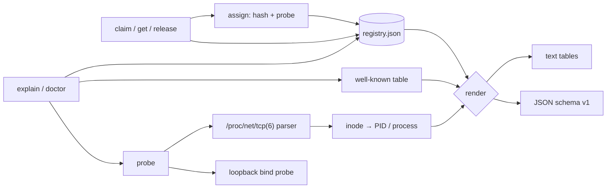

# portberth

[English](README.md) | [中文](README.zh.md) | [日本語](README.ja.md)

[](LICENSE) [](go.mod) [](CHANGELOG.md)  [](CONTRIBUTING.md)

**portberth：an open-source local port registry — every project gets a stable dev port, and every conflict gets an explanation with provenance. killport kills; portberth prevents.**


```bash
git clone https://github.com/JaydenCJ/portberth && cd portberth
go build -o portberth ./cmd/portberth    # single static binary, stdlib only
```

> Pre-release: v0.1.0 is not tagged on a package registry yet; build from source as above (any Go ≥1.22).

## Why portberth?

"Port 3000 already in use" greets every developer daily, and the standard answers all treat the symptom. `killport 3000` frees the port by killing whatever held it — including the database you forgot was yours. `lsof -i :3000` tells you a PID and leaves the archaeology to you. `get-port`-style libraries hand your dev server a *different* port each run, so bookmarks, OAuth callback URLs, and teammates' `.env` files rot. The actual problem is upstream: nobody assigned ports in the first place. portberth is the assignment step. `portberth claim shop/web` deterministically maps the name to a port in your dev range (hash + forward probe) and records it in a human-readable registry — so `shop/web` is the same port today, tomorrow, and on your other machine, with zero coordination. And when a port *is* contested, portberth refuses with receipts: which reservation holds it and since when, whether it is a well-known port (postgres, vite, redis, …), and which live process is squatting it right now, by PID and name.

| | portberth | killport | lsof / fuser | get-port libraries |
|---|---|---|---|---|
| Prevents conflicts up front (reservations) | ✅ | ❌ after the fact | ❌ after the fact | ❌ |
| Same port for a project, every run, every machine | ✅ deterministic | ❌ | ❌ | ❌ random free port |
| Explains *who* holds a port and *why* | ✅ registry + PID + well-known table | ❌ | PID only | ❌ |
| Registry auditing (`doctor`) | ✅ | ❌ | ❌ | ❌ |
| Kills processes | ❌ by design | ✅ | manual | ❌ |
| Works as a CLI for any stack | ✅ | ✅ | ✅ | ❌ per-language library |
| Runtime dependencies | 0 (Go stdlib) | Rust binary | preinstalled | npm/PyPI dep tree |

<sub>Dependency counts checked 2026-07-13: portberth imports the Go standard library only; killport is a fine tool for the killing use case — portberth simply argues you should rarely need it.</sub>

## Features

- **Stable, deterministic assignment** — `claim` hashes `project/service` into your range (default `3000-3999`) and probes forward past collisions; the same name maps to the same port on any machine, and other projects' reservations never move yours.
- **Conflict provenance, not just refusal** — an unavailable port is explained: the owning reservation with its claim date and note, the well-known identity (40 curated dev ports: postgres, vite, redis, kafka, …), and the live process squatting it (PID + name via `/proc`).
- **`explain` any port** — one command reports registry, well-known, and live-listener signals plus a verdict (`free`, `reserved, not in use`, `in use, not reserved`, `reserved and in use`) with matching exit codes for scripting.
- **`doctor` audits reality** — hand-edit damage (duplicate ports, invalid entries) is an error; reservations sitting on well-known ports or squatted by live processes are warnings; `--strict` escalates.
- **Made for scripts** — `get` prints the bare port for `$(...)`, `env --export` emits `SHOP_WEB_PORT=3708` lines, JSON output (`schema_version: 1`) everywhere, and claims are idempotent so start scripts can claim unconditionally.
- **A registry you can read** — one sorted, atomic-written JSON file (override via `--registry` / `PORTBERTH_REGISTRY`); commit it to dotfiles to share pins across a team. Format: [docs/registry-format.md](docs/registry-format.md).
- **Zero dependencies, fully offline** — Go standard library only; the only socket operation is an optional loopback bind probe that never sends a packet. No telemetry, no network, ever.

## Quickstart

```bash
portberth claim shop/web --note "storefront dev server"
portberth claim shop/api
portberth claim blog
portberth list
```

Real captured output:

```text
reserved shop/web -> 3708
reserved shop/api -> 3182
reserved blog -> 3855

PROJECT  SERVICE  PORT  SINCE       NOTE
blog     default  3855  2026-07-13
shop     api      3182  2026-07-13
shop     web      3708  2026-07-13  storefront dev server
```

Wire it into a dev server — `get` prints the bare port, `env` exports everything (real output):

```text
$ python3 -m http.server -b 127.0.0.1 "$(portberth get shop/web)"   # always 3708
$ portberth env shop --export
export SHOP_API_PORT=3182
export SHOP_WEB_PORT=3708
```

Ask why a port is not available (`portberth explain 3708` while that server runs, real output, exit code 1):

```text
port 3708

  registry    reserved by shop/web since 2026-07-13 (note: storefront dev server)
  well-known  no
  live        LISTENING on 127.0.0.1 by pid 21304 (python3)

verdict: reserved and in use
```

And requesting someone else's port is refused with receipts, never silently reassigned:

```text
$ portberth claim otherapp --port 3708
claim: port 3708 is not available for otherapp
  reserved by shop/web since 2026-07-13
hint: `portberth explain 3708` shows full provenance; omit --port to auto-assign
```

## CLI reference

`portberth <command> [flags] [args]` — every command accepts `--registry PATH` and `--format text|json`. Exit codes: 0 ok/free, 1 conflict or not found, 2 usage error, 3 runtime error.

| Command | Key flags | Effect |
|---|---|---|
| `claim <project>[/<service>]` | `--port`, `--range`, `--note`, `--probe`, `--allow-well-known` | reserve a stable port (idempotent); `--probe` also requires live-freeness |
| `get <spec>` | | print the bare port number, exit 1 if unreserved |
| `release <spec>` | `--all` | drop one reservation, or a whole project |
| `list` | `--project` | sorted table (or JSON) of all reservations |
| `env <project>` | `--export` | shell-ready `NAME_PORT=…` lines for every service |
| `explain <port>` | | registry + well-known + live provenance, verdict, exit 0 only if free |
| `doctor` | `--strict`, `--probe` | audit registry integrity and live conflicts |

| Key | Default | Effect |
|---|---|---|
| `PORTBERTH_REGISTRY` | `<user-config>/portberth/registry.json` | registry file location (flag `--registry` wins) |
| `PORTBERTH_RANGE` | `3000-3999` | auto-assign range (flag `--range` wins) |

Auto-assignment skips well-known ports (postgres 5432, vite 5173, …) by default; explicit `--port` requests may take them, with a warning.

## Verification

This repository ships no CI; every claim above is verified by local runs:

```bash
go test ./...            # 90 deterministic tests, offline, < 5 s
bash scripts/smoke.sh    # end-to-end CLI check, prints SMOKE OK
```

## Architecture



## Roadmap

- [x] v0.1.0 — deterministic stable assignment, JSON registry with atomic writes, conflict provenance (`claim --port` refusals, `explain`), procfs listener attribution, `doctor` audits, env/JSON output, 90 tests + smoke script
- [ ] `portberth run <spec> -- <cmd>` — claim, export, and exec in one step
- [ ] macOS listener attribution via `libproc` (today: loopback probe, no PID)
- [ ] Range policies per project prefix (e.g. `infra/*` → `9100-9199`)
- [ ] Import existing squatters (`doctor --adopt` turns live listeners into reservations)
- [ ] Shell completions and a `--quiet` mode for hooks

See the [open issues](https://github.com/JaydenCJ/portberth/issues) for the full list.

## Contributing

Issues, discussions and pull requests are welcome — see [CONTRIBUTING.md](CONTRIBUTING.md) for the local workflow (format, vet, tests, `SMOKE OK`). Good entry points are labelled [good first issue](https://github.com/JaydenCJ/portberth/issues?q=is%3Aissue+is%3Aopen+label%3A%22good+first+issue%22), and design questions live in [Discussions](https://github.com/JaydenCJ/portberth/discussions).

## License

[MIT](LICENSE)
