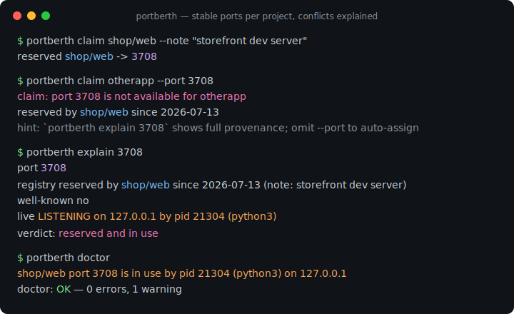
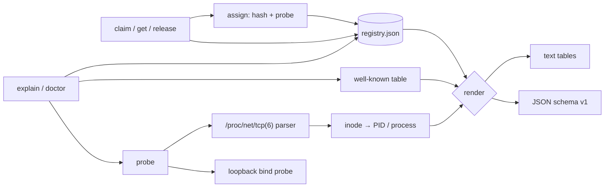

# portberth

[English](README.md) | [中文](README.zh.md) | [日本語](README.ja.md)

[](LICENSE) [](go.mod) [](CHANGELOG.md)  [](CONTRIBUTING.md)

**portberth：开源的本地端口注册表 —— 每个项目都拿到一个稳定的开发端口，每次冲突都附带来源证据的解释。killport 负责杀进程；portberth 负责让你不需要杀。**



```bash
git clone https://github.com/JaydenCJ/portberth && cd portberth
go build -o portberth ./cmd/portberth    # single static binary, stdlib only
```

> 预发布：v0.1.0 尚未发布到任何包仓库；请按上述方式从源码构建（任意 Go ≥1.22）。

## 为什么选 portberth？

"Port 3000 already in use" 每天都在问候每一位开发者，而常见的解法都只在治标。`killport 3000` 靠杀掉占用者来腾出端口——包括你忘了是自己启动的那个数据库。`lsof -i :3000` 只给你一个 PID，考古工作留给你自己。`get-port` 这类库每次运行都塞给 dev server 一个*不同的*端口，于是书签、OAuth 回调地址、同事的 `.env` 文件全都慢慢烂掉。真正的问题在上游：从一开始就没有人给端口做分配。portberth 补上的就是分配这一步。`portberth claim shop/web` 把名字确定性地映射到你的开发端口段里的一个端口（哈希 + 顺序探测），并记入一份人类可读的注册表——于是 `shop/web` 今天、明天、在你另一台机器上都是同一个端口，零协调成本。而当某个端口*确实*被争抢时，portberth 会拿着证据拒绝：哪条预约持有它、从何时起，它是否是知名端口（postgres、vite、redis 等），以及此刻是哪个活进程占着它——PID 和进程名一并给出。

| | portberth | killport | lsof / fuser | get-port 类库 |
|---|---|---|---|---|
| 事前预防冲突（预约机制） | ✅ | ❌ 事后处理 | ❌ 事后处理 | ❌ |
| 同一项目每次、每台机器都是同一端口 | ✅ 确定性 | ❌ | ❌ | ❌ 随机空闲端口 |
| 解释*谁*持有端口、*为什么* | ✅ 注册表 + PID + 知名端口表 | ❌ | 仅 PID | ❌ |
| 注册表审计（`doctor`） | ✅ | ❌ | ❌ | ❌ |
| 杀进程 | ❌ 有意不做 | ✅ | 手动 | ❌ |
| 作为 CLI 适用于任意技术栈 | ✅ | ✅ | ✅ | ❌ 语言绑定的库 |
| 运行时依赖 | 0（Go 标准库） | Rust 二进制 | 系统自带 | npm/PyPI 依赖树 |

<sub>依赖数量核查于 2026-07-13：portberth 仅导入 Go 标准库；killport 在"杀进程"这个场景下是个好工具——portberth 只是主张你本不该经常需要它。</sub>

## 特性

- **稳定的确定性分配** —— `claim` 把 `project/service` 哈希进你的端口段（默认 `3000-3999`）并越过冲突顺序探测；同一个名字在任何机器上映射到同一个端口，其他项目的预约永远不会挪动你的。
- **冲突给出来源，而不只是拒绝** —— 不可用的端口会被解释：持有它的预约及其登记日期和备注、知名端口身份（40 个精选开发端口：postgres、vite、redis、kafka 等）、以及正占着它的活进程（经 `/proc` 得到 PID + 进程名）。
- **对任意端口 `explain`** —— 一条命令报告注册表、知名端口、活监听三路信号，外加结论（`free`、`reserved, not in use`、`in use, not reserved`、`reserved and in use`）和配套的脚本友好退出码。
- **`doctor` 对照现实审计** —— 手改损坏（端口重复、条目非法）算错误；预约压在知名端口上或被活进程蹲占算警告；`--strict` 可升级为失败。
- **为脚本而生** —— `get` 只打印裸端口号供 `$(...)` 使用，`env --export` 输出 `SHOP_WEB_PORT=3708` 形式的行，处处可用 JSON 输出（`schema_version: 1`），且 claim 幂等——启动脚本可以无条件地 claim。
- **一份看得懂的注册表** —— 一个排好序、原子写入的 JSON 文件（可用 `--registry` / `PORTBERTH_REGISTRY` 覆盖）；提交到 dotfiles 即可在团队内共享端口钉选。格式见 [docs/registry-format.md](docs/registry-format.md)。
- **零依赖、完全离线** —— 仅 Go 标准库；唯一的套接字操作是可选的回环绑定探测，从不发送任何数据包。没有遥测，没有网络，永远。

## 快速上手

```bash
portberth claim shop/web --note "storefront dev server"
portberth claim shop/api
portberth claim blog
portberth list
```

真实捕获的输出：

```text
reserved shop/web -> 3708
reserved shop/api -> 3182
reserved blog -> 3855

PROJECT  SERVICE  PORT  SINCE       NOTE
blog     default  3855  2026-07-13
shop     api      3182  2026-07-13
shop     web      3708  2026-07-13  storefront dev server
```

接进 dev server —— `get` 打印裸端口，`env` 一次导出全部（真实输出）：

```text
$ python3 -m http.server -b 127.0.0.1 "$(portberth get shop/web)"   # always 3708
$ portberth env shop --export
export SHOP_API_PORT=3182
export SHOP_WEB_PORT=3708
```

问一问某端口为何不可用（该服务运行时执行 `portberth explain 3708`，真实输出，退出码 1）：

```text
port 3708

  registry    reserved by shop/web since 2026-07-13 (note: storefront dev server)
  well-known  no
  live        LISTENING on 127.0.0.1 by pid 21304 (python3)

verdict: reserved and in use
```

索要别人的端口会被拿着证据拒绝，绝不悄悄改派：

```text
$ portberth claim otherapp --port 3708
claim: port 3708 is not available for otherapp
  reserved by shop/web since 2026-07-13
hint: `portberth explain 3708` shows full provenance; omit --port to auto-assign
```

## CLI 参考

`portberth <command> [flags] [args]` —— 每个命令都接受 `--registry PATH` 和 `--format text|json`。退出码：0 成功/空闲，1 冲突或未找到，2 用法错误，3 运行时错误。

| 命令 | 主要标志 | 作用 |
|---|---|---|
| `claim <project>[/<service>]` | `--port`、`--range`、`--note`、`--probe`、`--allow-well-known` | 预约一个稳定端口（幂等）；`--probe` 额外要求当下确实空闲 |
| `get <spec>` | | 打印裸端口号，未预约则退出码 1 |
| `release <spec>` | `--all` | 释放一条预约，或整个项目 |
| `list` | `--project` | 所有预约的排序表格（或 JSON） |
| `env <project>` | `--export` | 为每个服务输出 shell 可用的 `NAME_PORT=…` 行 |
| `explain <port>` | | 注册表 + 知名端口 + 活监听三路来源与结论，仅当空闲时退出码为 0 |
| `doctor` | `--strict`、`--probe` | 审计注册表完整性与现实冲突 |

| 键 | 默认值 | 作用 |
|---|---|---|
| `PORTBERTH_REGISTRY` | `<user-config>/portberth/registry.json` | 注册表文件位置（`--registry` 标志优先） |
| `PORTBERTH_RANGE` | `3000-3999` | 自动分配端口段（`--range` 标志优先） |

自动分配默认跳过知名端口（postgres 5432、vite 5173 等）；显式 `--port` 请求可以占用它们，但会给出警告。

## 验证

本仓库不附带 CI；上面的每一条声明都由本地运行验证：

```bash
go test ./...            # 90 deterministic tests, offline, < 5 s
bash scripts/smoke.sh    # end-to-end CLI check, prints SMOKE OK
```

## 架构



## 路线图

- [x] v0.1.0 —— 确定性稳定分配、原子写入的 JSON 注册表、冲突来源证据（`claim --port` 拒绝、`explain`）、procfs 监听归属、`doctor` 审计、env/JSON 输出、90 个测试 + smoke 脚本
- [ ] `portberth run <spec> -- <cmd>` —— 一步完成 claim、导出与 exec
- [ ] 经 `libproc` 的 macOS 监听归属（目前：回环探测，无 PID）
- [ ] 按项目前缀的端口段策略（如 `infra/*` → `9100-9199`）
- [ ] 收编既有占用者（`doctor --adopt` 把活监听转为预约）
- [ ] Shell 补全与面向钩子的 `--quiet` 模式

完整列表见 [open issues](https://github.com/JaydenCJ/portberth/issues)。

## 参与贡献

欢迎 issue、讨论与 PR —— 本地工作流（格式化、vet、测试、`SMOKE OK`）见 [CONTRIBUTING.md](CONTRIBUTING.md)。入门任务标为 [good first issue](https://github.com/JaydenCJ/portberth/issues?q=is%3Aissue+is%3Aopen+label%3A%22good+first+issue%22)，设计讨论在 [Discussions](https://github.com/JaydenCJ/portberth/discussions)。

## 许可证

[MIT](LICENSE)
